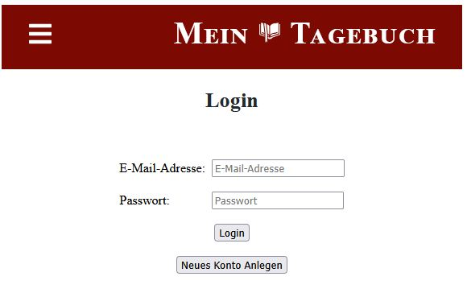

# 📘 Tagebuch-App

> Ein Studienprojekt zur Demonstration eines einfachen Login-Systems mit Cookie-Verwaltung.  
> Entwickelt im Rahmen des Kurses **Projektmanagement**.

---
### 🔑 Login Screen


---

## 🧭 Motivation

Ziel des Projekts war es, ein funktionierendes Login-System umzusetzen, das Nutzerdaten mithilfe von 
Cookies speichert und so den Zugang zur Webanwendung ermöglicht. Sicherheitsaspekte standen dabei 
**nicht im Vordergrund**, sondern die funktionale Umsetzung und das Verständnis von Projektplanung,
-umsetzung und -dokumentation.

---

## ⚙️ Features

- 🔐 Benutzer-Login & Logout
- 🍪 Speicherung der Nutzerdaten über Cookies
- 🌐 Zugriff auf geschützte Bereiche nach Login
- ❌ Automatisches Löschen des Cookies bei Logout

---

## 🧰 Technologie-Stack

| Bereich | Technologie / Version             |
|:--------|:----------------------------------|
| **Backend** | Quarkus `2.16.6`, Gradle `3.5.0`  |
| **Frontend / Build** | React `18.2.0`, Node.js `18.12.1` |
| **Datenbank** | PostgreSQL (Docker)               |
| **Sprache** | Java `17`                         |

**Verwendete Quarkus-Erweiterungen:**
```gradle
implementation 'io.quarkus:quarkus-resteasy-reactive-jsonb'
implementation 'io.quarkus:quarkus-hibernate-orm'
implementation 'io.quarkus:quarkus-hibernate-validator'
implementation 'io.quarkus:quarkus-smallrye-openapi'
implementation 'io.quarkus:quarkus-jdbc-postgresql'
implementation 'io.quarkus:quarkus-security-jpa'
implementation 'io.quarkus:quarkus-arc'
testImplementation 'io.quarkus:quarkus-junit5'
testImplementation 'io.rest-assured:rest-assured'
```
> 🧪 Ordner für test und native-test sind vorhanden, enthalten aber derzeit keine implementierten Tests.

---

## 🛠️ Installation & Setup
Voraussetzungen

- Docker installiert und lauffähig
- PostgreSQL läuft in einem Container
- Java 17, Gradle, Node.js installiert (oder über das Build-Skript)

Schritte
```shell script
#Repository klonen
git clone https://github.com/pgs3238/TagebuchApp.git
cd tagebuchapp

# Build ausführen (installiert Node, npm-Abhängigkeiten und führt Build aus)
./gradlew build

# Anwendung im Entwicklungsmodus starten
./gradlew quarkusDev
```
---

## 🚀 Nutzung

1. Anwendung starten
2. Im Browser die Login-Seite öffnen
3. Benutzerkonto anlegen
4. Benutzer anmelden → Cookie wird gesetzt
5. Zugriff auf geschützte Seiten möglich
6. Logout → Cookie wird gelöscht

---

## ⚠️ Hinweise

> 🔒 Dieses Projekt dient ausschließlich zu Lern- und Demonstrationszwecken.
Die Cookie-basierte Speicherung von Nutzerdaten ist nicht für produktive Umgebungen geeignet.

---

## 🧑‍💻 Autor & Kontakt
| Name                | Kontakt                                                                                                                                                                |
|:--------------------|:-----------------------------------------------------------------------------------------------------------------------------------------------------------------------|
| Paul-Gerhard Siegel | [GitHub](https://github.com/pgs3238) · [LinkedIn](https://www.linkedin.com/in/paul-gerhard-siegel-719a4512/) · [Xing](https://www.xing.com/profile/PaulGerhard_Siegel) |
| Mitwirkender        | @Mehmet5561                                                                                                                                                                       |